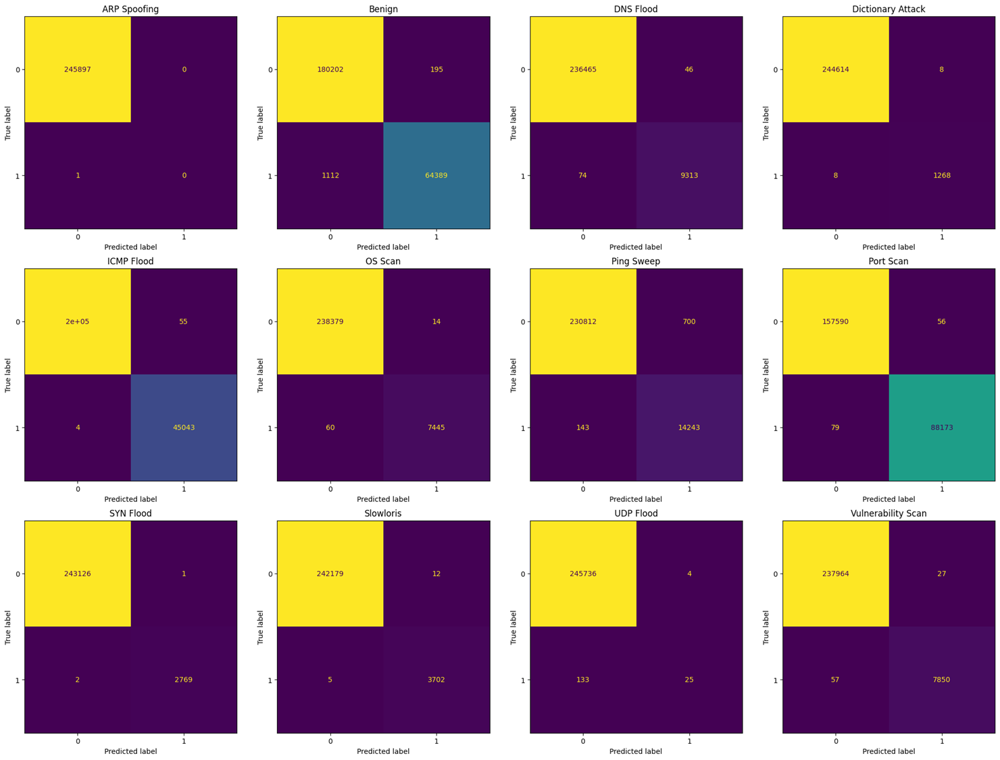

# ACI-IoT-Attack-Detection

This project aims to detect various types of attacks in IoT networks using a neural network. The dataset used for training and evaluation is the ACI-IoT-2023 dataset.

## Dataset

The Army Cyber Institute (ACI) Internet of Things (IoT) Network Traffic Dataset 2023 (ACI-IoT-2023) is a cutting-edge dataset created specifically for machine learning (ML) applications in IoT network security. This dataset provides a unique and realistic resource for training and evaluating ML models in IoT network environments, filling a gap in available resources and supporting the development of ML-driven solutions to enhance the security of IoT operations.

Cite:

Nathaniel Bastian, David Bierbrauer, Morgan McKenzie, Emily Nack, December 29, 2023, "ACI IoT Network Traffic Dataset 2023", IEEE Dataport, doi:https://dx.doi.org/10.21227/qacj-3x32.

## Tools

The following tools and libraries are used in this project:

- Python 3
- PyTorch
- scikit-learn
- pandas
- numpy

## Usage

1. Preprocess the data:

- Download the ACI-IoT-2023 dataset. https://www.kaggle.com/datasets/emilynack/aci-iot-network-traffic-dataset-2023
    ```sh
    python DataPreprocess.py
    ```

2. Train and evaluate the model:
    ```sh
    python main.py
    ```

    To save predictions to a CSV file, run:
    ```sh
    python main.py 1
    ```

## Evaluation

The main.py script evaluates the performance of the model detecting the 12 different attack types and provides accuracy, precision, recall, and F1 score for each label as well as overall performance. 

The overall results are:
- Accuracy: 	0.9929
- Precision:	0.9954
- Recall:		0.9932
- F1:           0.9947




